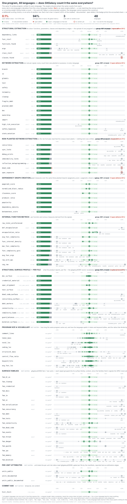

# Cross-Language Bias Report

Generated by `tools/bias_report.py` over 46 locked language(s): abap, ada, agc_assembly, apex, assembly, c, cobol, cpp, csharp, css, dart, dockerfile, embedded_python, fortran, go, groovy, haskell, html, java, javascript, jcl, kotlin, livecode, lua, m4, makefile, markdown, matlab, objective-c, perl, php, powershell, python, ruby, rust, scala, scheme, shell, solidity, sqlite, swift, tcl, typescript, yacc, yaml, zig.

Planted intent is identical in every language (SPEC.md probe table), so any column-to-column divergence below is measured language bias — an extraction inequality or a scoring inequality. Every known deviation is validated in `deviation_ledger.json`; see per-language `expected_signals.json` notes for the shape-by-shape accounting.

**n/a semantics:** 38 language/signal cells are marked n/a — the language's registry entry defines no rule for that signal, so the engine cannot ever report a nonzero there. Those cells are *incomparable*, not zero: they are excluded from medians, deviation bands, and consistency scores rather than counted as −100% divergence. An n/a does **not** certify the absence is correct — that takes a validated ledger entry (docs/GATING.md).

**WARNING: unreviewed rule absences** (no validated ledger entry records why the language lacks the concept — each is either real morphology to ledger, or a missing-rule engine gap like jcl's pre-#2610 `safety`): `agc_assembly/class_start`, `css/cleanup`, `css/io`, `css/state_mutation`, `css/telemetry`, `html/globals`, `html/high_risk_execution`, `html/state_mutation`, `m4/class_start`, `makefile/class_start`, `shell/class_start`, `solidity/io`, `yacc/class_start`, `yacc/test`, `yaml/cleanup`, `yaml/ownership`.

## Cross-language variance chart

Each metric's badge is its **consistency score**: the share of languages inside the green band (±25% of the cross-language median). **Average across 33 metrics: 78%**; 18 metrics hold ≥80% of languages in the green band. Weakest metrics: risk_cognitive_load 15%, risk_api_exposure 41%, state_mutation 47%, risk_documentation 52%, safety 53%. Skipped (no comparable data): risk_concurrency, risk_dead_code, classes_found, class_start.

## Signal totals vs. planted intent

| signal | planted | abap | ada | agc_assembly | apex | assembly | c | cobol | cpp | csharp | css | dart | dockerfile | embedded_python | fortran | go | groovy | haskell | html | java | javascript | jcl | kotlin | livecode | lua | m4 | makefile | markdown | matlab | objective-c | perl | php | powershell | python | ruby | rust | scala | scheme | shell | solidity | sqlite | swift | tcl | typescript | yacc | yaml | zig |
|---|---|---|---|---|---|---|---|---|---|---|---|---|---|---|---|---|---|---|---|---|---|---|---|---|---|---|---|---|---|---|---|---|---|---|---|---|---|---|---|---|---|---|---|---|---|---|---|
| branch ⚠ | 3 | 3 | 5 | 4 | 5 | 25 | 4 | 4 | 5 | 6 | 3 | 5 | 4 | 5 | 4 | 4 | 5 | 4 | 3 | 5 | 5 | 3 | 5 | 7 | 4 | 3 | 4 | n/a | 5 | 4 | 5 | 9 | 7 | 3 | 5 | 3 | 5 | 3 | 6 | 5 | 5 | 6 | 6 | 5 | 3 | 3 | 5 |
| io ⚠ | 3 | 3 | 3 | 3 | 3 | 4 | 5 | 4 | 3 | 3 | n/a† | 3 | 6 | 4 | 3 | 3 | 3 | 3 | 3 | 3 | 4 | 3 | 3 | 3 | 4 | 3 | 4 | n/a | 4 | 3 | 4 | 3 | 4 | 3 | 3 | 3 | 3 | 3 | 4 | n/a† | 11 | 3 | 8 | 3 | 3 | 3 | 3 |
| high_risk_execution ⚠ | 2 | 2 | 2 | 2 | 2 | 2 | 2 | 3 | 2 | 2 | 2 | 2 | 3 | 2 | 3 | 2 | 2 | 2 | n/a† | 2 | 2 | 2 | 2 | 2 | 2 | 2 | 2 | n/a | 2 | 2 | 2 | 2 | 2 | 3 | 2 | 3 | 2 | 3 | 2 | 2 | 2 | 2 | 2 | 2 | 2 | 2 | 2 |
| globals ⚠ | 2 | 2 | 2 | 2 | 2 | 2 | 2 | 3 | 2 | 3 | 0 | 4 | 2 | 2 | 2 | 2 | 2 | 2 | n/a† | 2 | 2 | n/a | 2 | 2 | 2 | 2 | 2 | n/a | 2 | 2 | 2 | 2 | 2 | 2 | 2 | 2 | 2 | 2 | 3 | 2 | 2 | 2 | 2 | 2 | 2 | 2 | 5 |
| test ⚠ | 2 | 2 | 2 | 2 | 2 | 2 | 3 | 2 | 2 | 2 | 2 | 2 | 2 | 3 | 2 | 2 | 2 | 2 | 2 | 2 | 2 | n/a | 2 | 2 | 2 | 2 | 2 | n/a | 2 | 2 | 3 | 2 | 2 | 2 | 2 | 2 | 2 | 2 | 2 | 2 | 2 | 2 | 2 | 2 | n/a† | 1 | 2 |
| safety ⚠ | 2 | 3 | 2 | 2 | 3 | 2 | 2 | 2 | 3 | 3 | 1 | 3 | 1 | 5 | 2 | 2 | 3 | 4 | 2 | 3 | 3 | 2 | 2 | 3 | 2 | 2 | 2 | n/a | 3 | 2 | 3 | 3 | 3 | 2 | 2 | 2 | 2 | 2 | 2 | 2 | 2 | 2 | 3 | 4 | 2 | 1 | 3 |
| safety_bypasses ⚠ | 2 | 2 | 2 | 2 | 3 | 2 | 2 | 2 | 2 | 2 | 0 | 2 | 2 | 2 | 3 | 5 | 2 | 4 | 0 | 2 | 2 | 2 | 2 | 4 | 4 | 2 | 2 | n/a | 3 | 2 | 2 | 2 | 2 | 2 | 3 | 2 | 2 | 2 | 3 | 2 | 0 | 0 | 3 | 2 | 2 | 1 | 2 |
| telemetry ⚠ | 2 | 2 | 2 | 2 | 2 | 2 | 2 | 2 | 2 | 2 | n/a† | 2 | 2 | 2 | 2 | 2 | 2 | 2 | 0 | 2 | 2 | 2 | 2 | 2 | 2 | 2 | 2 | n/a | 2 | 2 | 2 | 2 | 2 | 2 | 2 | 2 | 2 | 2 | 2 | 2 | 2 | 2 | 2 | 2 | 2 | 2 | 2 |
| state_mutation ⚠ | 2 | 2 | 6 | 2 | 7 | 6 | 11 | 2 | 9 | 6 | n/a† | 6 | 6 | 6 | 3 | 11 | 6 | 8 | n/a† | 6 | 2 | 2 | 6 | 9 | 6 | 4 | 6 | n/a | 33 | 9 | 10 | 6 | 7 | 2 | 6 | 2 | 6 | 3 | 6 | 9 | 3 | 6 | 9 | 6 | 2 | 1 | 6 |
| cleanup ⚠ | 2 | 2 | 2 | 2 | 2 | 2 | 2 | 2 | 2 | 2 | n/a† | 2 | 2 | 2 | 2 | 2 | 2 | 2 | 0 | 2 | 2 | n/a | 2 | 2 | 2 | 2 | 3 | n/a | 4 | 2 | 2 | 2 | 2 | 2 | 2 | 2 | 2 | 2 | 2 | 2 | 2 | 2 | 2 | 2 | 2 | n/a† | 2 |
| fragile_debt | 1 | 1 | 1 | 1 | 1 | 1 | 1 | 1 | 1 | 1 | 1 | 1 | 1 | 1 | 1 | 1 | 1 | 1 | 1 | 1 | 1 | 1 | 1 | 1 | 1 | 1 | 1 | n/a | 1 | 1 | 1 | 1 | 1 | 1 | 1 | 1 | 1 | 1 | 1 | 1 | 1 | 1 | 1 | 1 | 1 | 1 | 1 |
| planned_debt | 1 | 1 | 1 | 1 | 1 | 1 | 1 | 1 | 1 | 1 | 1 | 1 | 1 | 1 | 1 | 1 | 1 | 1 | 1 | 1 | 1 | 1 | 1 | 1 | 1 | 1 | 1 | n/a | 1 | 1 | 1 | 1 | 1 | 1 | 1 | 1 | 1 | 1 | 1 | 1 | 1 | 1 | 1 | 1 | 1 | 1 | 1 |
| import ⚠ | 3 | 3 | 3 | 3 | 3 | 3 | 3 | 3 | 3 | 3 | 3 | 3 | 4 | 7 | 3 | 3 | 3 | 3 | 3 | 3 | 3 | 3 | 3 | 3 | 3 | 3 | 3 | n/a | 3 | 3 | 3 | 3 | 3 | 3 | 3 | 3 | 3 | 3 | 3 | 3 | 3 | 3 | 3 | 3 | 3 | 3 | 3 |
| func_start ⚠ | 13 | 13 | 13 | 13 | 13 | 13 | 13 | 13 | 13 | 13 | 13 | 13 | 17 | 13 | 13 | 13 | 13 | 15 | 0 | 13 | 14 | 13 | 13 | 13 | 13 | 13 | 14 | n/a | 13 | 13 | 13 | 13 | 13 | 13 | 13 | 13 | 13 | 13 | 13 | 13 | 13 | 13 | 13 | 13 | 13 | 13 | 13 |
| args ⚠ | 13 | 13 | 13 | 2 | 18 | 13 | 13 | 1 | 13 | 13 | 3 | 13 | 4 | 13 | 13 | 13 | 19 | 15 | 3 | 13 | 14 | 13 | 13 | 13 | 13 | 18 | 1 | n/a | 13 | 21 | 13 | 13 | 13 | 13 | 13 | 13 | 13 | 13 | 13 | 13 | 1 | 13 | 13 | 15 | 2 | 0 | 13 |
| class_start ⚠ | 0 | 0 | 0 | n/a† | 0 | 0 | 0 | 1 | 0 | 0 | 1 | 0 | 4 | 0 | 0 | 0 | 0 | 0 | 0 | 0 | 0 | 1 | 2 | 0 | 0 | n/a† | n/a† | n/a | 0 | 0 | 0 | 0 | 0 | 0 | 0 | 0 | 0 | 0 | n/a† | 0 | 0 | 0 | 0 | 0 | n/a† | 7 | 0 |
| doc ⚠ | 1 | 2 | 1 | 2 | 2 | 1 | 1 | 1 | 1 | 1 | 0 | 1 | 1 | 2 | 2 | 1 | 2 | 1 | 2 | 2 | 1 | n/a | 2 | 2 | 1 | 1 | 1 | n/a | 1 | 1 | 1 | 2 | 1 | 2 | 1 | 1 | 2 | 1 | 1 | 2 | 1 | 1 | 1 | 1 | 1 | 2 | 1 |
| ownership ⚠ | 1 | 1 | 1 | 1 | 1 | 1 | 1 | 1 | 1 | 1 | 0 | 1 | 1 | 1 | 1 | 1 | 1 | 1 | 1 | 1 | 1 | 1 | 1 | 1 | 1 | 1 | 1 | n/a | 1 | 1 | 1 | 1 | 1 | 1 | 1 | 1 | 1 | 1 | 1 | 4 | 1 | 1 | 1 | 1 | 1 | n/a† | 1 |

n/a = no rule defined for this language (incomparable, excluded from bands and medians); † = absence not yet backed by a validated ledger entry.

## Structure found (corpus totals)

| metric | abap | ada | agc_assembly | apex | assembly | c | cobol | cpp | csharp | css | dart | dockerfile | embedded_python | fortran | go | groovy | haskell | html | java | javascript | jcl | kotlin | livecode | lua | m4 | makefile | markdown | matlab | objective-c | perl | php | powershell | python | ruby | rust | scala | scheme | shell | solidity | sqlite | swift | tcl | typescript | yacc | yaml | zig |
|---|---|---|---|---|---|---|---|---|---|---|---|---|---|---|---|---|---|---|---|---|---|---|---|---|---|---|---|---|---|---|---|---|---|---|---|---|---|---|---|---|---|---|---|---|---|---|
| functions_found | 13 | 0 | 13 | 13 | 13 | 13 | 13 | 13 | 13 | 13 | 13 | 17 | 13 | 13 | 13 | 13 | 13 | 0 | 13 | 14 | 13 | 13 | 16 | 16 | 13 | 0 | 0 | 16 | 13 | 9 | 13 | 13 | 13 | 16 | 13 | 13 | 13 | 16 | 13 | 28 | 13 | 13 | 13 | 13 | 3 | 13 |
| classes_found | 0 | 0 | 0 | 0 | 0 | 0 | 1 | 0 | 0 | 1 | 0 | 4 | 0 | 0 | 0 | 0 | 0 | 0 | 0 | 0 | 1 | 2 | 0 | 0 | 0 | 0 | 0 | 0 | 0 | 0 | 0 | 0 | 0 | 0 | 0 | 0 | 0 | 0 | 0 | 0 | 0 | 0 | 0 | 0 | 0 | 0 |
| dependency_links | 3 | 3 | 3 | 0 | 3 | 3 | 3 | 3 | 3 | 3 | 3 | 4 | 7 | 3 | 3 | 3 | 3 | 3 | 3 | 3 | 4 | 3 | 3 | 3 | 0 | 3 | 3 | 3 | 3 | 3 | 3 | 3 | 3 | 3 | 3 | 3 | 0 | 3 | 3 | 3 | 0 | 3 | 3 | 0 | 3 | 3 |
| keyword_hits | 162 | 176 | 227 | 232 | 198 | 280 | 248 | 251 | 268 | 147 | 262 | 185 | 309 | 281 | 288 | 260 | 146 | 135 | 259 | 229 | 178 | 289 | 244 | 267 | 174 | 186 | 134 | 278 | 260 | 299 | 257 | 266 | 334 | 256 | 299 | 273 | 197 | 239 | 273 | 171 | 290 | 237 | 293 | 153 | 176 | 300 |
| comment_lines | 12 | 12 | 12 | 12 | 12 | 12 | 14 | 12 | 12 | 10 | 12 | 11 | 11 | 11 | 12 | 12 | 12 | 10 | 12 | 19 | 11 | 12 | 12 | 12 | 12 | 12 | 34 | 12 | 12 | 11 | 12 | 11 | 15 | 12 | 12 | 12 | 12 | 12 | 15 | 12 | 12 | 12 | 12 | 12 | 10 | 12 |
| pagerank | 0.2000 | 0.2000 | 0.2000 | 0.2000 | 0.2000 | 0.2000 | 0.2000 | 0.2000 | 0.2000 | 0.2000 | 0.2000 | 0.2000 | 0.2000 | 0.2000 | 0.2000 | 0.2000 | 0.2000 | 0.2000 | 0.2000 | 0.1667 | 0.2000 | 0.2000 | 0.2000 | 0.2000 | 0.2000 | 0.2000 | 0.2000 | 0.2000 | 0.2000 | 0.2000 | 0.2000 | 0.2000 | 0.1667 | 0.2000 | 0.2000 | 0.2000 | 0.2000 | 0.2000 | 0.2000 | 0.2000 | 0.2000 | 0.2000 | 0.2000 | 0.2000 | 0.2000 | 0.2000 |

## Mean per-file risk scores

| risk | abap | ada | agc_assembly | apex | assembly | c | cobol | cpp | csharp | css | dart | dockerfile | embedded_python | fortran | go | groovy | haskell | html | java | javascript | jcl | kotlin | livecode | lua | m4 | makefile | markdown | matlab | objective-c | perl | php | powershell | python | ruby | rust | scala | scheme | shell | solidity | sqlite | swift | tcl | typescript | yacc | yaml | zig |
|---|---|---|---|---|---|---|---|---|---|---|---|---|---|---|---|---|---|---|---|---|---|---|---|---|---|---|---|---|---|---|---|---|---|---|---|---|---|---|---|---|---|---|---|---|---|---|
| risk_api_exposure | 5.591 | 0.000 | 1.887 | 0.000 | 5.364 | 11.569 | 5.808 | 5.289 | 5.335 | 0.000 | 5.358 | 1.051 | 8.752 | 9.731 | 1.892 | 5.358 | 0.000 | 1.051 | 5.313 | 4.624 | 6.938 | 5.311 | 7.413 | 11.106 | 0.000 | 0.959 | 0.000 | 5.335 | 5.335 | 2.414 | 5.311 | 9.639 | 7.404 | 5.335 | 5.289 | 9.285 | 0.000 | 5.284 | 5.261 | 0.000 | 0.897 | 5.556 | 5.311 | 0.000 | 0.000 | 2.098 |
| risk_churn | 0.000 | 0.000 | 0.000 | 0.000 | 0.000 | 0.000 | 0.000 | 0.000 | 0.000 | 0.000 | 0.000 | 0.000 | 0.000 | 0.000 | 0.000 | 0.000 | 0.000 | 0.000 | 0.000 | 0.000 | 0.000 | 0.000 | 0.000 | 0.000 | 0.000 | 0.000 | 0.000 | 0.000 | 0.000 | 0.000 | 0.000 | 0.000 | 0.000 | 0.000 | 0.000 | 0.000 | 0.000 | 0.000 | 0.000 | 0.000 | 0.000 | 0.000 | 0.000 | 0.000 | 0.000 | 0.000 |
| risk_cognitive_load | 7.076 | 24.246 | 4.000 | 26.053 | 32.988 | 19.726 | 6.562 | 17.846 | 14.447 | 4.000 | 15.454 | 4.000 | 21.656 | 4.824 | 14.113 | 23.292 | 5.535 | 4.000 | 22.485 | 8.408 | 4.000 | 17.419 | 6.298 | 24.860 | 4.000 | 10.027 | 0.000 | 43.816 | 23.770 | 23.017 | 18.958 | 28.625 | 3.584 | 22.456 | 5.268 | 22.516 | 4.000 | 28.012 | 25.362 | 4.000 | 16.792 | 5.383 | 15.454 | 4.000 | 5.689 | 24.275 |
| risk_concurrency | 0.000 | 0.000 | 14.879 | 0.000 | 0.000 | 0.000 | 0.000 | 0.000 | 0.000 | 0.000 | 0.000 | 0.000 | 0.000 | 0.000 | 0.000 | 0.000 | 0.000 | 0.000 | 19.998 | 0.000 | 0.000 | 0.000 | 0.000 | 0.000 | 0.000 | 0.000 | 0.000 | 0.000 | 0.000 | 0.000 | 0.000 | 0.000 | 0.000 | 0.000 | 0.000 | 0.000 | 0.000 | 0.000 | 0.000 | 0.000 | 9.756 | 0.000 | 0.000 | 0.000 | 0.000 | 0.000 |
| risk_dead_code | 0.000 | 0.000 | 0.000 | 0.000 | 0.000 | 0.000 | 0.000 | 0.000 | 0.000 | 0.000 | 0.000 | 0.000 | 0.000 | 0.000 | 0.000 | 0.000 | 0.000 | 0.000 | 0.000 | 0.000 | 0.000 | 0.000 | 0.000 | 0.000 | 0.000 | 40.509 | 0.000 | 0.000 | 0.000 | 0.000 | 0.000 | 0.000 | 0.000 | 0.000 | 0.000 | 0.000 | 0.000 | 0.000 | 0.000 | 0.000 | 0.000 | 0.000 | 0.000 | 0.000 | 0.000 | 0.000 |
| risk_documentation | 66.427 | 56.096 | 44.386 | 51.427 | 73.135 | 79.970 | 53.458 | 58.383 | 47.278 | 26.440 | 47.803 | 38.103 | 74.428 | 71.712 | 46.565 | 68.268 | 43.125 | 32.400 | 46.964 | 53.166 | 32.789 | 58.370 | 72.843 | 77.779 | 22.936 | 47.530 | 3.770 | 68.608 | 69.474 | 69.513 | 58.146 | 81.655 | 56.405 | 58.817 | 47.121 | 79.922 | 45.411 | 69.974 | 68.354 | 38.093 | 9.743 | 62.973 | 47.575 | 27.189 | 42.790 | 68.836 |
| risk_safety_score | 36.677 | 37.169 | 38.376 | 53.966 | 37.383 | 44.467 | 53.122 | 35.163 | 34.441 | 19.848 | 34.563 | 55.625 | 36.601 | 69.941 | 45.135 | 37.051 | 56.352 | 0.000 | 34.269 | 28.112 | 38.702 | 34.925 | 54.367 | 69.788 | 57.404 | 38.451 | 0.000 | 71.319 | 37.833 | 53.549 | 34.258 | 53.273 | 39.960 | 35.670 | 36.351 | 37.211 | 38.977 | 37.755 | 37.813 | 37.391 | 32.474 | 38.082 | 34.563 | 39.020 | 36.907 | 37.073 |
| risk_secrets_risk | 0.000 | 0.000 | 0.000 | 0.000 | 0.000 | 0.000 | 0.000 | 0.000 | 0.000 | 0.000 | 0.000 | 0.000 | 0.000 | 0.000 | 0.000 | 0.000 | 0.000 | 0.000 | 0.000 | 0.000 | 0.000 | 0.000 | 0.000 | 0.000 | 0.000 | 0.000 | 0.000 | 0.000 | 0.000 | 0.000 | 0.000 | 0.000 | 0.000 | 0.000 | 0.000 | 0.000 | 0.000 | 0.000 | 0.000 | 0.000 | 0.000 | 0.000 | 0.000 | 0.000 | 0.000 | 0.000 |
| risk_spec_match | 89.333 | 98.667 | 65.333 | 96.000 | 96.000 | 96.000 | 80.000 | 96.000 | 96.000 | 45.333 | 96.000 | 61.333 | 90.667 | 88.000 | 96.000 | 96.000 | 65.333 | 52.000 | 96.000 | 80.000 | 52.000 | 96.000 | 89.333 | 93.333 | 41.333 | 78.667 | 20.000 | 96.000 | 96.000 | 97.333 | 96.000 | 97.333 | 72.222 | 96.000 | 96.000 | 96.000 | 77.333 | 97.333 | 96.000 | 64.000 | 96.000 | 89.333 | 96.000 | 46.667 | 73.333 | 96.000 |
| risk_stability | 50.000 | 50.000 | 50.000 | 50.000 | 50.000 | 50.000 | 50.000 | 50.000 | 50.000 | 50.000 | 50.000 | 50.000 | 50.000 | 50.000 | 50.000 | 50.000 | 50.000 | 50.000 | 50.000 | 41.667 | 50.000 | 50.000 | 50.000 | 50.000 | 50.000 | 50.000 | 10.000 | 50.000 | 50.000 | 50.000 | 50.000 | 50.000 | 41.667 | 50.000 | 50.000 | 50.000 | 50.000 | 50.000 | 50.000 | 50.000 | 50.000 | 50.000 | 50.000 | 50.000 | 50.000 | 50.000 |
| risk_state_flux | 19.475 | 20.000 | 19.977 | 35.488 | 20.000 | 38.764 | 19.945 | 20.000 | 20.000 | 0.000 | 20.000 | 39.998 | 20.000 | 37.057 | 20.000 | 20.000 | 39.887 | 0.000 | 20.000 | 13.551 | 20.000 | 19.998 | 20.000 | 20.000 | 40.000 | 20.000 | 0.000 | 79.910 | 20.000 | 34.530 | 20.000 | 34.530 | 16.327 | 20.000 | 18.187 | 19.999 | 19.997 | 20.000 | 20.000 | 0.000 | 20.000 | 20.000 | 19.999 | 20.000 | 16.459 | 20.000 |
| risk_tech_debt | 40.000 | 20.000 | 40.000 | 79.970 | 39.979 | 39.267 | 40.000 | 39.267 | 35.870 | 40.000 | 35.870 | 40.000 | 39.970 | 39.979 | 35.384 | 39.958 | 20.000 | 20.000 | 35.870 | 32.584 | 40.000 | 39.267 | 20.000 | 39.979 | 80.000 | 20.000 | 0.000 | 39.942 | 40.000 | 20.000 | 39.267 | 39.921 | 32.845 | 39.267 | 35.870 | 39.958 | 80.000 | 39.970 | 39.986 | 20.000 | 75.870 | 39.979 | 35.870 | 80.000 | 20.000 | 39.958 |
| risk_verification | 2.278 | 2.278 | 1.724 | 2.486 | 2.748 | 2.387 | 2.014 | 2.390 | 2.373 | 1.274 | 2.368 | 1.702 | 2.315 | 2.273 | 2.356 | 2.457 | 1.798 | 1.195 | 2.363 | 1.991 | 1.510 | 2.399 | 2.389 | 2.431 | 1.288 | 1.828 | 0.460 | 2.483 | 2.452 | 2.400 | 2.391 | 2.508 | 1.814 | 2.430 | 2.360 | 2.455 | 2.079 | 2.544 | 2.467 | 1.940 | 2.387 | 2.259 | 2.368 | 1.308 | 1.775 | 2.465 |

A risk-score spread on identical intent is the bottom-line bias number: same program, different measured risk, purely from language expression plus the ledgered engine behaviors.
